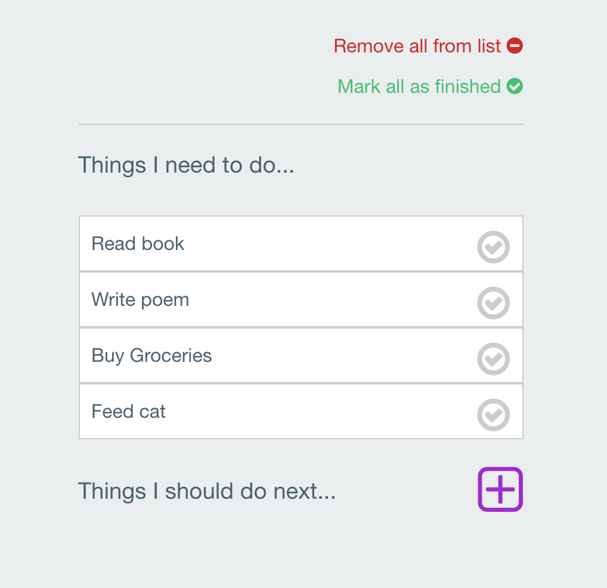

# To-Do List

This small application was built to create a simple to-do list.  

It utilizes:

* HTML5/CSS3
* jQuery/javascript
* [Foundation](http://foundation.zurb.com/)
* [Font Awesome](https://fortawesome.github.io/Font-Awesome/)

To run or use this app:

1. [Fork it](https://github.com/erintherad/todoList)
2. Clone it
3. Run a simple server such as <code>http-server<code>

